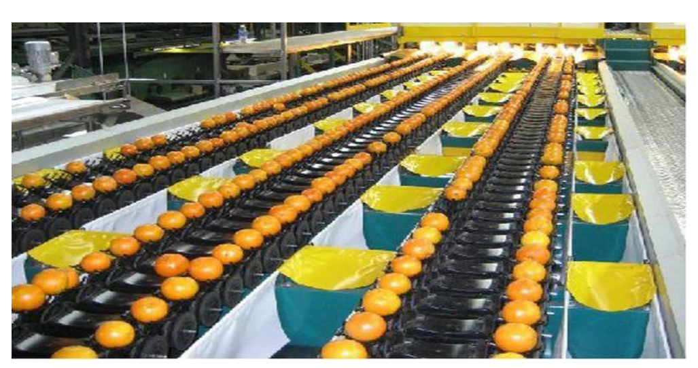
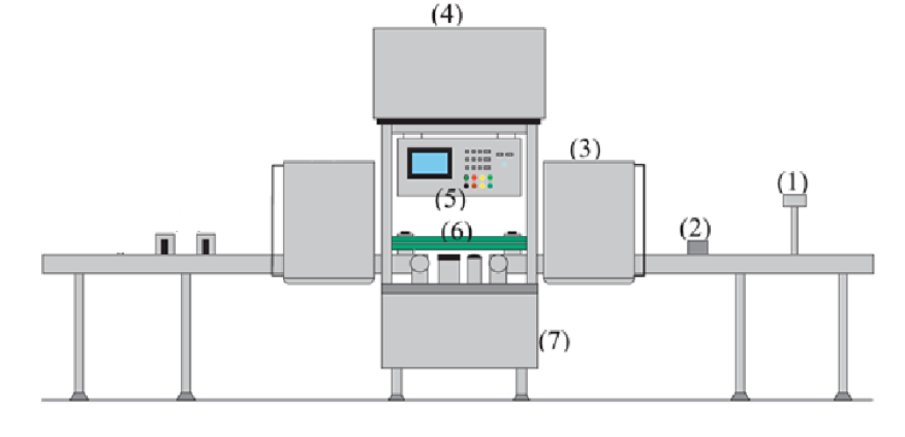
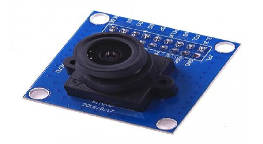
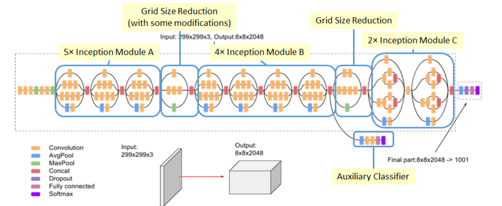
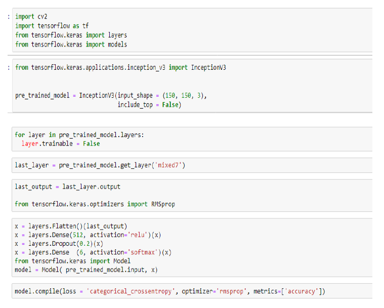
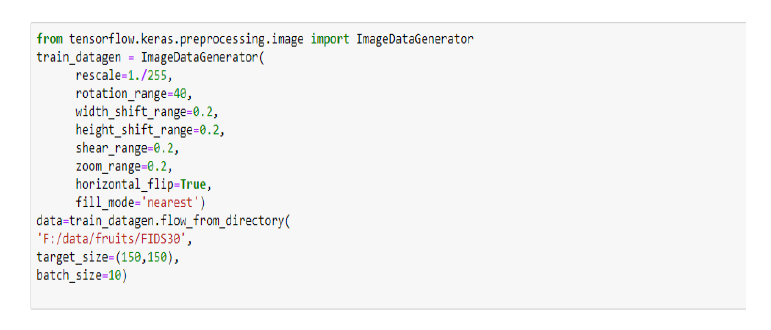
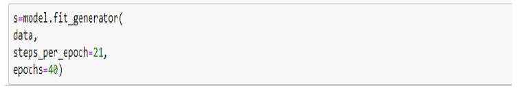
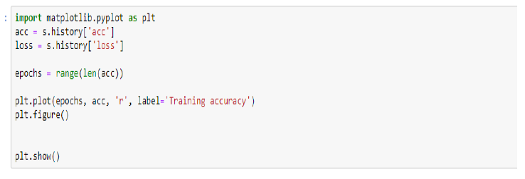
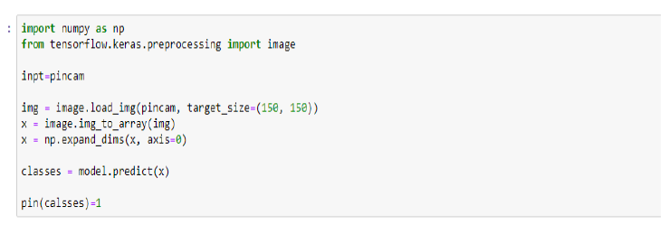

# Classification of fruits images

## In this project for QeshmVoltage company , we want to seperate fruits in production line .

Assume that in production line we have 6 different fruits that sequencely enter in a box and we want design a robot that after taking a picture of this fruit decides to put it in the certain group  

for separating these fruits we have used a CNN network with 213 images in 6 categories .

we have used Transfer learning tecknique by INCEPTION V3 network .

## PRODECTION LINE

## ROBOT

## CAMERA

## CNN NETWORK SCHEMATIC

## CNN NETWORK PYTHON CODE

## ORDERING TO THE ROBOT 

## RESULT
Accuracy of our network  : 

                            96.12%   for 312 images in 6 categories

